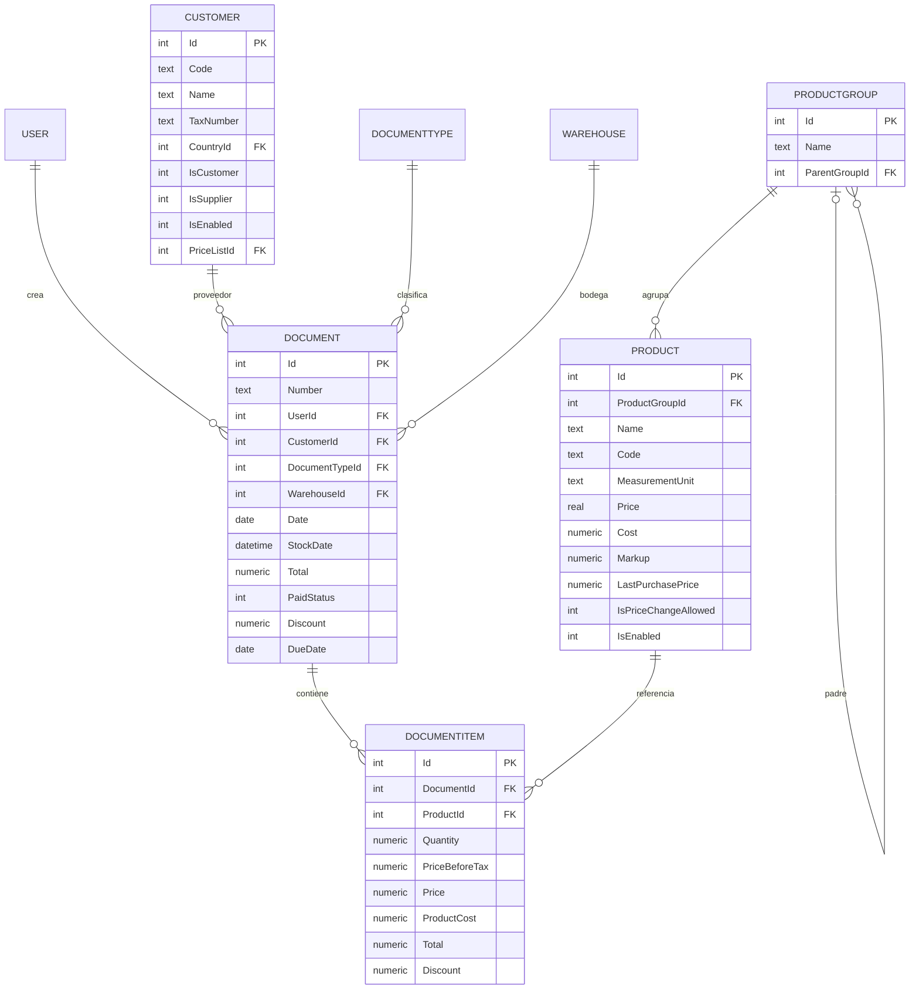

# Nero — Knowledge

> What is true about this product right now.

## Purpose

App móvil que escanea la **factura de compra** (una o **varias fotos** si ocupa varias
páginas), extrae sus líneas, **mapea el proveedor y los productos** contra los datos del
negocio, deja **revisar/editar** el resultado y luego **inserta el documento en el POS** para
que aparezca en caja. También permite **editar el precio de un producto** cuando el proveedor
lo sube o baja.

Sirve a **cajeros/operarios** del supermercado. Hoy la captura manual les consume ~1 h/día
(~14% de un turno de 7 h, ~27 h/mes); el fin es eliminar ese trabajo repetitivo.

## Architecture overview

Cuatro piezas:

1. **App móvil** — captura una o varias fotos de la factura, muestra el detalle, permite editar y confirmar.
2. **Extracción foto→JSON** — modelo de visión que combina las páginas en un solo
   resultado: proveedor + líneas estructuradas (nombre, cantidad, precio, impuesto).
3. **Servicio de mapeo** — mantiene la metadata del negocio (`Customer` proveedores,
   catálogo de `Product`, usuarios, tipos de documento) y asocia el **proveedor → `CustomerId`**
   y cada **línea → `ProductId`**; marca lo no mapeado (proveedor o producto nuevo).
4. **Escritura al POS** — inserta `Document` + `DocumentItem` en el SQLite local, crea el
   `Customer`/`Product` nuevo si hace falta y actualiza `Product` (precio/costo).

El POS guarda los datos en SQLite. Modelo relevante:

> Para tipo "compra", `CustomerId` actúa como **proveedor**: es un registro de `Customer` con
> `IsSupplier = 1` (un mismo `Customer` puede ser cliente y proveedor a la vez).
> `DocumentItem` borra en cascada con su `Document`. `ProductGroup` es jerárquico
> (`ParentGroupId` apunta a sí mismo). La edición de precio actúa sobre `Product`
> (`Price`/`Cost`/`Markup`). `PriceList` y `Country` existen pero hoy **no se usan**
> (`CountryId` por defecto = 47 → CO).

## Key domains

- **Captura / OCR** — una o varias fotos de la factura → resultado unificado.
- **Mapeo de proveedor** — nombre del proveedor extraído → `CustomerId` (`IsSupplier = 1`).
- **Mapeo de productos** — línea de factura → `ProductId` del catálogo.
- **Revisión** — el usuario valida y corrige antes de ingestar.
- **Escritura al POS** — inserción de `Document`/`DocumentItem` en SQLite.
- **Edición de precio** — ajustar `Product.Price`/`Cost`/`Markup`.

## Active constraints

- El POS es **local sobre SQLite**; el teléfono no escribe archivos remotos directamente →
  **topología de escritura no resuelta** (recomendación: agente/API local en el PC del POS).
- Insertar filas podría **no actualizar Stock** si el POS lo maneja por lógica de aplicación
  y no por triggers → falta el esquema completo para confirmarlo.
- `Number` sigue el formato `AA-100-NNNNNN` (ej. `26-100-000001`) → debe generarse sin colisión.
- Una factura puede venir en **varias fotos** (varias páginas) → la extracción debe unificarlas
  en un solo documento.
- El **proveedor puede no existir** en el POS → si no mapea a un `Customer` (`IsSupplier = 1`),
  hay que crearlo. Mínimo: `Name` (de la factura); `CountryId = 47` (CO) por defecto;
  `IsSupplier = 1`. Opcional: `Code`, `TaxNumber` (NIT).
- Editar precio solo si `Product.IsPriceChangeAllowed = 1`; al ingestar una compra suele
  actualizarse `Cost`/`LastPurchasePrice`, mientras `Price` (venta) lo decide el usuario.
- La app **no** necesita datos de ventas ni de stock; solo la metadata para guardar (catálogo
  de producto + id, usuario/cajero, tipos de documento).

## Stack recomendado

| Pieza | Recomendación | Por qué |
|---|---|---|
| App móvil | **Flutter** | Un solo código iOS+Android, buena cámara, ideal para equipo pequeño. |
| Extracción foto→JSON | **Claude vision** (`claude-opus-4-8` / `claude-sonnet-4-6`) vía Anthropic API | Maneja facturas de layout irregular mejor que OCR clásico; devuelve líneas estructuradas. |
| Servicio de mapeo | **Python (FastAPI)** | Tiene catálogo (`Product`) y proveedores (`Customer`); mapea proveedor→`CustomerId` y línea→`ProductId` (código exacto → fuzzy `rapidfuzz` → embeddings); marca nuevos. |
| Revisión/edición | Pantalla en Flutter | El usuario confirma o corrige; incluye editar precio. |
| Escritura al POS | **Agente/API local en el PC del POS** (decisión abierta) | Inserta `Document`+`DocumentItem`, actualiza `Product`, genera `Number`, calcula `Total`/`StockDate`. |
